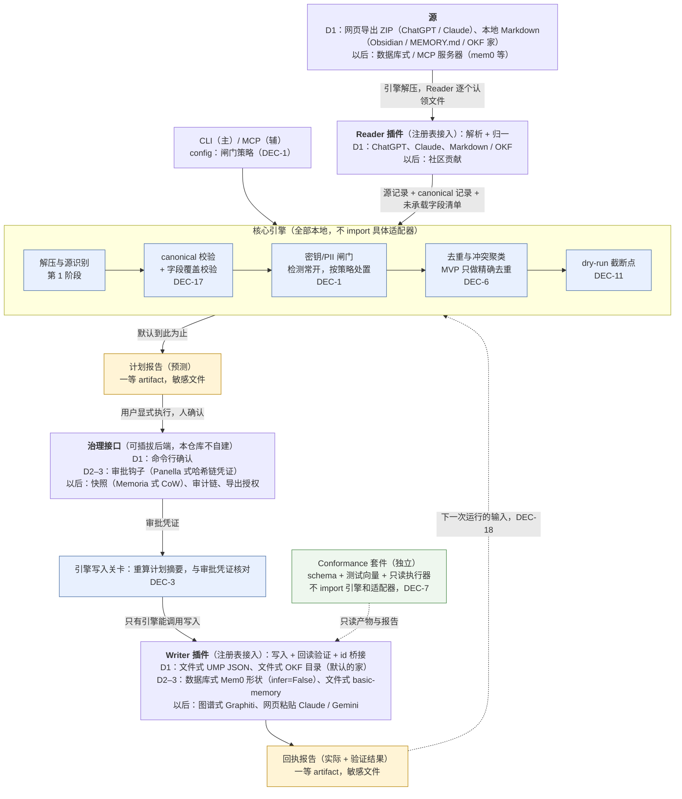
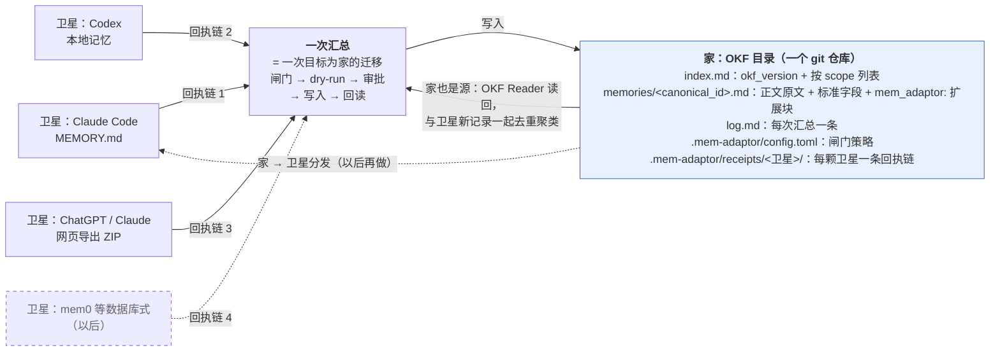
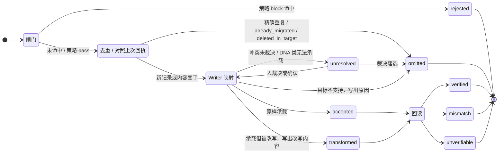

# 框架图与流程图

四张图对应 [design.md](design.md) 的同一套设计，图里的编号（第 n 阶段、DEC-n）都指向 design.md。
改设计时先改 design.md，再回来同步这里；两边冲突以 design.md 为准。

框里标了交付阶段（D1 / D2–3 / 以后），虚线框是 D1 之后才做的。渲染好的图片在 [diagrams/](diagrams/)。

## 1. 框架图：模块与边界

谁调用谁、谁不许 import 谁。

要点：

- 引擎和插件之间只通过注册表和数据交接；Reader 不碰闸门，Writer 不能自己决定写不写。
- 闸门在去重之前、在一切出站路径之前，因为去重可能调 embedding，报告本身也会被分享。
- 回执报告指回引擎，就是全部的跨次运行状态，不另建账本。

## 2. 流程图：一次运行

从敲下命令到产出回执，每个分叉点在哪里。

```mermaid
flowchart TD
    classDef stop fill:#fde8e8,stroke:#b94a4a
    classDef artifact fill:#fff4d6,stroke:#b8860b
    classDef human fill:#eef7ee,stroke:#4a8a4a

    START(["mem-adaptor 运行"]) --> P0{"有闸门策略配置？"}
    P0 -- "有" --> PREV
    P0 -- "没有，交互运行" --> ASK["询问策略<br/>默认选项：放行，并说明后果"]:::human
    P0 -- "没有，非交互" --> DEF["按默认放行<br/>标注「来自默认值，未经用户选择」"]
    ASK --> PREV
    DEF --> PREV

    PREV{"有上一次回执报告？"}
    PREV -- "有" --> LOAD["读入：身份映射、content_hash、<br/>验证结果、裁决"]
    PREV -- "没有" --> FIRST["按首次迁移处理<br/>目标已有数据则在计划报告里警告"]
    LOAD --> S1
    FIRST --> S1

    S1["1 解压与源识别<br/>拒绝跳出目录的路径<br/>无人认领的文件进源清单"] --> S2
    S2["2 解析（Reader）<br/>原样字段"] --> S3
    S3["3 归一（Reader）<br/>canonical + 字段映射表 + 未承载字段清单"] --> V
    V{"引擎校验<br/>schema 合规？源字段都有去处？"}
    V -- "有字段两边都没出现" --> VFLAG["引擎标出漏掉的字段<br/>进计划报告"] --> S4
    V -- "通过" --> S4

    S4["4 闸门检测<br/>命中记入 sensitive_findings<br/>只记规则 id + 位置，不记命中值"] --> G{"该级别策略？"}
    G -- "block" --> REJ["rejected"]:::stop
    G -- "pass" --> S5
    REJ --> S6

    S5["5 去重与冲突聚类<br/>精确重复 → omitted duplicate_of<br/>对照上次回执：already_migrated /<br/>deleted_in_target 不重写 / 沿用旧裁决"] --> S6

    S6["6 生成计划报告<br/>逐条预测处置 + 能力声明 + 模型调用预估<br/>+ 闸门策略 + 计划摘要"]:::artifact --> DRY{"用户显式要求执行？"}
    DRY -- "否（默认）" --> END1(["结束：只产出计划报告<br/>目标未被触碰"])
    DRY -- "是" --> S7

    S7["7 人工确认 / 审批<br/>裁决冲突簇、确认 DNA 类 unresolved、<br/>block 模式下逐条放行高危 PII"]:::human --> RCPT["审批凭证<br/>绑定计划摘要"]
    RCPT --> CHK{"写入前重算计划摘要<br/>与凭证一致？"}
    CHK -- "不一致" --> END2(["拒写：批的是计划 A，<br/>现在跑出来的是 B"]):::stop
    CHK -- "一致" --> S8

    S8["8 写入（Writer）<br/>按目标类映射 + id 桥接"] --> S9
    S9["9 回读验证<br/>用目标自己的读接口"] --> RES{"回读结果"}
    RES -- "一致" --> OK["verified"]
    RES -- "不一致" --> MM["mismatch，附差异"]
    RES -- "目标无法回读<br/>如网页粘贴" --> UV["unverifiable"]
    OK --> RR
    MM --> RR
    UV --> RR
    RR["回执报告"]:::artifact --> END3(["结束<br/>回执作为下一次运行的输入"])
```

要点：

- 两个硬截断点都在引擎里：dry-run（默认在这里结束）和计划摘要核对。
- 闸门策略在运行最开始就确定，并被计划摘要锁住；中途改策略要重新出计划报告。
- 人只在第 7 阶段介入一次，所有需要人决定的事（冲突、DNA 类、高危 PII 放行）都集中在这里。

## 3. 家模式：卫星汇总进家

要点：

- N 颗卫星只有 N 条回执链，不是两两同步的 N² 条；跨工具冲突在汇总时第一次放到同一张清单上。
- 卫星里消失的记录默认不动家，由人在计划报告里决定 `status: deprecated` 还是移除。
- 回执和配置都存在家目录里，随家走；家目录推到公开远端等于公开全部记忆。

## 4. 单条记录的处置

一条记录在计划报告里落到五态之一，执行后在回执报告里再加一个验证结果。

